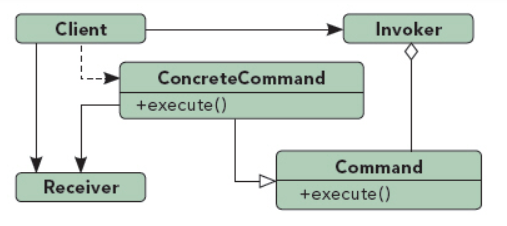

## 命令模式

UML图：

In my option, Command Pattern declares a set of command, Client can use these commands to invoke Receiver by Invoker.

命令模式主要目的是有效的做到责任分离，按照一定结构，在程序中引入包括客户程序、调用者程序、被调用者程序

命令模式的优点：
1. 实现调用者和被调用者之间的解耦
2. 很容易被扩展，只需新增一个ConcreteCommand即可
3. 命令模式支持将多个命令装配成一个符合命令
4. 命令模式支持操作的取消和重做，只需要ConcreteCommand类存储额外的状态信息