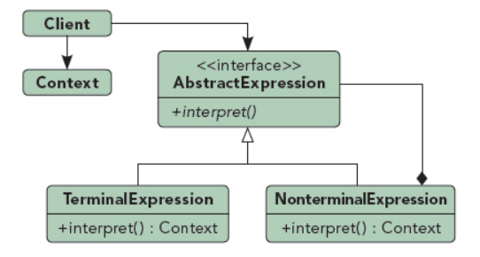

## 解释器模式

UML图：

组成部分：
1. AbstractExpression：抽象表达式
2. TerminalExpression：终结表达式
3. NonterminalExpression：终结表达式
4. Context：环境类

优点：
1. 易于改变和扩展文法。
2. 易于实现文法。
3. 增加了新的解释表达式的方式。

缺点：
1. 对于复杂文法难以维护。
2. 执行效率较低。
3. 应用场景很有限。