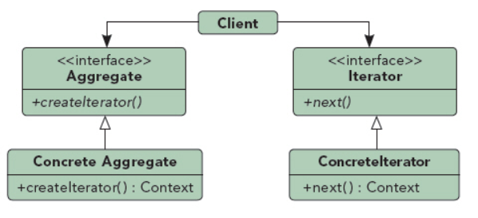

## 迭代器模式

UML图：

组成部分:
1. Aggregate：聚合接口，实现子类将创建并维持一种数据的聚合体
2. ConcreteAggregate：封装了数据存储结构，列表、Map等，
3. Iterator：迭代器定义访问和遍历元素的接口
4. ConcreteIterator：具体的迭代器实现类

优点：
1. 支持以不同方式遍历同一个聚合，将不同的遍历算法封装在不同的迭代器子类中
2. 修改一个遍历算法时不会影响其他算法
3. 若聚合结构不变，遍历算法也不需要改变
4. 简化了聚合的接口，只需提供一个createIterator()