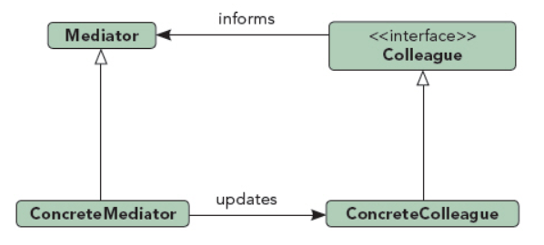

## 中介者模式

UML图：

当一个系统的对象之间有太多的交互，以至于程序很难调控时，可以通过引进一个中介者减少耦合

中介者模式的要点是将所有对象之间的交互细节抽象到一个具体的类中，即中介者类

组成部分：
1. 中介者接口Mediator
2. 具体中介者ConcreteMediator：可以有多个中介者
3. 参与者对象接口Colleague
4. 具体的参与者ConcreteColleague

优点：
1. 所有对象的交互行为都被转入到一个独立的中介者对象中，使得用户更容易通过中介者修改对象之间的相互关系行为，修改交互行为时只需修改中介者类
2. 使单元测试容易
3. 使得一个类的修改不会影响到其他类
