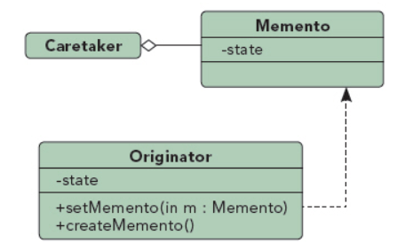

## 备忘录模式

UML图：

组成部分：
1. Memento备忘录角色：存储备忘发起人的内部状态，
2. Originator备忘录发起人
3. Caretaker备忘录管理者：负责保存备忘录，不能对备忘录进行操作或检查

备忘录有两个接口，分别是：
1. 窄接口：负责人（Caretaker）对象（和其他除发起人对象之外的任何对象）看到的是备忘录的窄接口(narrow interface)，这个窄接口只允许它把备忘录对象传给其他的对象。 
2. 宽接口：与负责人对象看到的窄接口相反的是，发起人对象可以看到一个宽接口(wide interface)，这个宽接口允许它读取所有的数据，以便根据这些数据恢复这个发起人对象的内部状态。

优点：
1. 使用备忘录模式，可以避免暴露一些只应由源发器管理却又必须存储在源发器之外的信息，而且能够在对象需要时恢复到先前的状态。

缺点：
2. 使用备忘录可能代价很高。如果源发器在生成备忘录时必须复制并存储大量的信息，或者客户非常频繁地创建备忘录和恢复源发器状态，可能会导致非常大的开销。