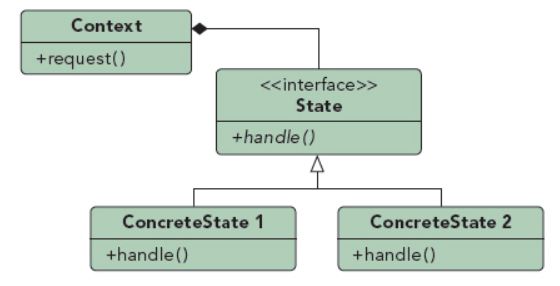

## 状态模式

UML图：

组成部分：
1. Context：定义了与客户程序的接口，保持了一个ConcreteState的代表现在状态的实例
2. State：定义了状态接口，各个子类封装了不同状态下的行为
3. ConcreteState：封装了不同状态下的行为

Context说明：
1. Context类代表状态相关的与现有ConcreteState有关的请求
2. Context类可以将自己作为一个参数传递给状态对象
3. 是与客户交互的主要接口，Client不必与State类直接交互
4. Context或State超类或子类都可以决定状态变化顺序

优点：
1. 因为状态相关的代码都被封装在各个状态子类中，所以容易加新的状态
2. 不同状态封装成不同的类，是的状态迁移明确，防止Context将状态弄混

