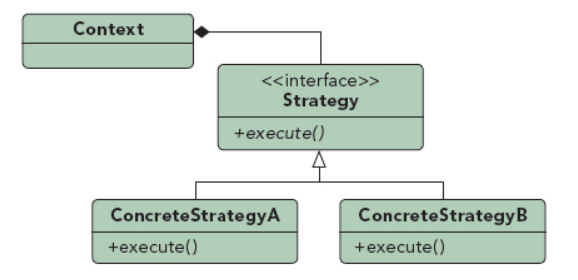

## 策略模式

UML图：

面向对象设计遵循的一个基本原则是责任分离，另一个原则是高内聚低耦合

组成部分：
1. Strategy：定义了一个共同的接口，所有算法类实现这个接口
2. ConcreteStrategy：封装了具体功能算法，实现同一个接口

使用策略模式的场景
1. 当多个仅在行为上不同但是相关的类存在时，策略模式提供一个为一个类配置多种行为之一的方法
2. 使用策略模式可以将算法的具体实现隐藏起来
3. 当一个类有多种行为，条件块很大时，可以分为多个策略

优点：
1. 得到一系列可复用的算法，算法集成一个共同的抽象类
2. 各个算法的变化可以更独立
3. 扩展容易，只需编译新的具体策略类
