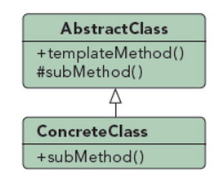

## 模板方法模式

UML图：

作用：

在不改变模板结构的前提下在子类中重新定义模板中的内容。

优点：
1. 提高复用性：将相同部分的代码放在抽象的父类中，而将不同的代码放入不同的子类中
2. 反向控制：通过一个父类调用其子类的操作，通过对子类的具体实现扩展不同的行为，实现了反向控制 & 符合“开闭原则”
3. 提高扩展性：将不同的代码放入不同的子类中，通过对子类的扩展增加新的行为

缺点：
1. 引入了抽象类，每一个不同的实现都需要一个子类来实现，导致类的个数增加，从而增加了系统实现的复杂度。
2. 代码可读性差，不知具体方法在何处调用