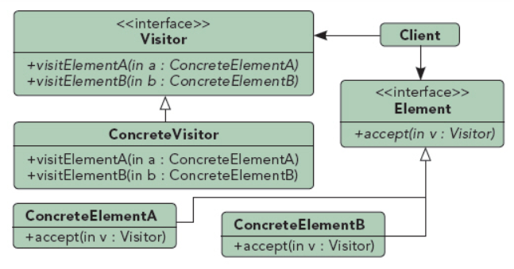

## 访问者模式

UML图：

访问者模式在处理数据结构较稳定，但是作用于其上的操作需要经常变化的问题时是非常有效的

访问者模式是指作用域一个对象结构体上的元素的操作，访问者使用户在不改变改结构体中类基础上定义一个新的操作

组成部分：
1. Visitor：为每个Element声明一个访问操作，方法最好包含访问类的名字，以便确认
2. ConcreteVisitor：实现Visitor声明的运算，提供算法环境以及存储局部状态
3. Element：定义了一些基本方法，包含基本数据方法，例如get()和set()，必须定义接受者方法，其作用是为被访问者对象与访问者对象之间的交互提供接口
4. ConcreteElement：具体的Element子类
5. (ObjectStructure)：在Client和Element中可以提供一个高层接口，允许访问者访问子类，提供所要访问的Element类列表

使用访问者模式的场景：
1. 一个对象结构中包含多种类型的具有不同接口的对象，切用户要在这些对象上进行依赖于其具体类的运算时
2. 当有多个不同的并且互不相关的运算将作用到这些对象上，用户不希望运算混淆这些类，用访问者模式将相关的操作放在一个独立的类中
3. 对象中的数据类型很少改变，但操作需要经常改变

优点：
1. 针对复杂类结构中的某个类添加方法较容易，只需简单地添加一个新的访问者方法即可，否则需在每个类中都加
2. 方法集中在一个具体的类中，其他方法放在另一个具体类中，即可以分类

缺点：
1. 增加一个新的ConcreteElement较困难，需要在每个ConcreteVisitor中添加访问方法