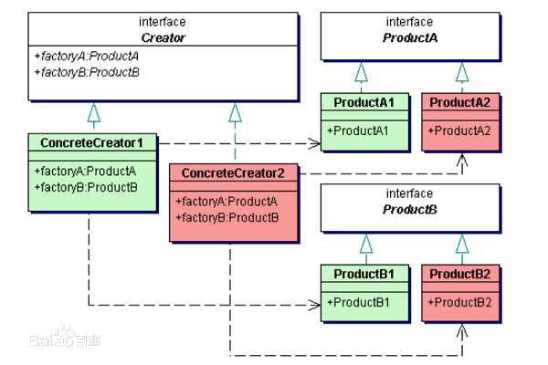

## 抽象工厂模式

抽象工厂模式和工厂方法模式有类似的概念：抽象工厂模式和工厂模式一样是层次类的结构，但是在这里它不仅仅负责创建一个产品类，而是创建一族产品类对象。

抽象工厂模式包括：
1. 一系列互有关联的产品类，这些产品类有相同的结构
2. 一系列工厂类，实现由抽象工厂类提供的接口。

抽象工厂模式帮助程序员避免了重复的、复杂的条件语句，提供了必要的创建对象的接口。

UML图：

抽象工厂模式的两种设计方法：同工厂方法模式（可以将层次类的超类设计为接口或抽象类）。

抽象工厂模式的可扩展性：
1. 当需要增加新产品ProductA3和ProductB3时，只需要增加一个ConcreteCreator3即可，符合开闭原则
2. 当需要增加新产品层次类ProductC，就必须修改每个ConcreteCreator，新增ProductC方法，此时不符合开闭原则
