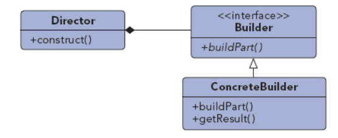

## 生成器模式

UML图：

生成器模式按照一个指定的过程逐步创建一个复杂的对象，允许用户只通过指定复杂对象的类型和内容就可以构建它们，不必知道其中细节。

主要思想：抽象出创建对象的步骤，使得这些步骤的不同实现可以创建对象的不同表示。通常生成器模式被用来创建符合组合模式的产品对象。

UML图解析：
1. Builder：创建Product对象的接口
2. ConcreteBuilder：
    1. 实现Builder接口，创建并组装对象
    2. 定义并跟踪创建的产品对象
    3. 提供一个返回产品对象的接口
3. Director：使用Builder接口创建一个完整的产品对象，负责管理正确的对象创建顺序，从参数中接收具体ConcreteBuilder对象，并执行这些对象的操作
4. Product（可以使类，也可以是带有子类的类）：
    1. 待创建的组装对象
    2. 包含组件子类，包括组装接口
    
生成器模式特点：
1. 可以让用户变化创建产品的内部表达式,也隐藏了装配的细节
2. 生成器之间相互独立
3. 用户可以更多的控制产品结构

