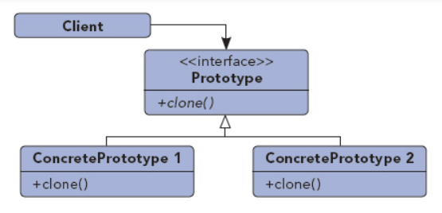

## 原型模式

UML图：

浅拷贝：

    创建一个新的实例，并对成员对象逐个拷贝。
深拷贝：

    不仅要复制对象的所有非引用成员变量值，还要为引用类型的成员变量创建新的实例

clone()方法满足：
1. 对任何的对象x，都有x.clone() !=x，即克隆对象与原对象不是同一个对象。 
2. 对任何的对象x，都有x.clone().getClass()==x.getClass()，即克隆对象与原对象的类型一样。 
3. 如果对象x的equals()方法定义恰当，那么x.clone().equals(x)应该成立。

原型模式向客户隐藏了创建对象的复杂性。客户只需要知道要创建对象的类型，然后通过请求就可以获得和该对象一模一样的新对象，无须知道具体的创建过程。

原型模式使用场景：
1. 创建对象成本太大，只需复制即可
2. 用来做备份