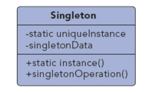

## 单例模式

UML图：

单例模式就是确保一个类只有一个实例，并提供一个全局的访问点

将构造函数设为private，使对象不能通过构造函数创建，开放唯一的getInstance方法用于创建/返回对象

单例模式的优点：
1. 严格控制了客户对对象的访问。
2. 单例模式的子类都是单例类，每个子类可以有不同的行为，使用户在运行时可配置不同的子类（Spring的Context）
3. 可以变为只存在n个对象实例

##### 多线程中的单例模式：
    在判断后创建前是进程被抢占，将会导致后生成的实例覆盖先生成的实例。
    需要在getInstance方法上加上synchronized修饰符实现同步

单例模式的其他实现方式：
1. 静态内部类
2. 双重校验锁
