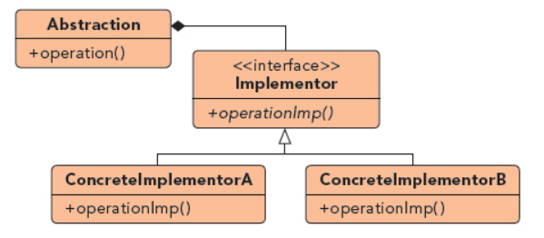

## 桥接模式

UML图：

当一个抽象有几种不同实现方法的时候，一个有效的方法是使用面向对象的继承概念，将其设计为层次类，但会印象可扩展性，尤其当层次类包含多个维度变化，此时桥接模式是一个解决方法

组成部分：
1. Abstraction接口：定义抽象部分的接口，维持Implementor对象的参考
2. Implementor接口：只提供较原始的功能
3. ConcreteImplementor：具体实现类

优点
1. 分离接口和实现部分
2. 提高可扩展性
3. 实现细节对客户的透明
