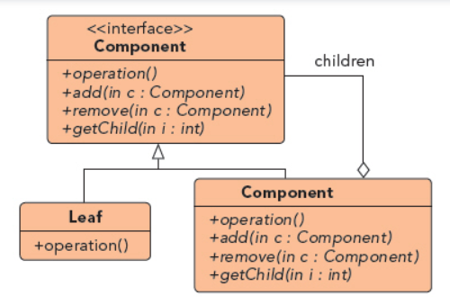

## 组合模式

UML图：

1. component：为组合模式的对象声明接口，用于访问和管理其子组件
2. Leaf：表示叶节点对象，没有子节点，实现了Component的所有方法
3. component(二级)： component的子节点，但自身也是component

优点：
1. 定义了组合对象的层次结构，可以被组合成更复杂的组合对象
2. 简化客户代码，客户无需知道是叶节点还是组合组件
3. 容易添加新类型的组件
4. 使设计变得更通用

两种形式的组合模式
1. 安全模式：接口只提供operation，而不提供其他leaf不需要的操作，这样保证安全性，但超类和子类接口不一致。
2. 透明模式：接口实现全部方法，Leaf中的一些方法抛出UnsupportedOperationException
