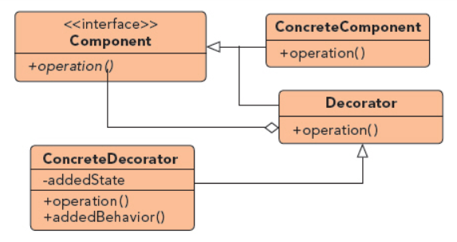

## 装饰器模式

UML图：

通俗来讲就是将一个对象进行包装后再开放给用户使用

IO中输入输出流的设计就是装饰器模式

装饰器模式用于降低系统耦合，动态的增加和删除某一对象的职责，并使需要装饰的具体构建类和具体装饰类可以独立变化

优点：
1. 扩展对象功能比继承灵活，不会导致类的个数剧增
2. 可以对一个对象进行多次装饰，创造出不同的行为，得到功能强大的对象
3. 具体构建类和装饰类可以独立变化

缺点：
1. 产生小对象，一定程度上影响性能
2. 调试排查较麻烦

思考：

为何要兜这么一圈来实现？仅仅是想要多一行输出，我直接继承ConceretComponent，或者直接在另一个Component的实现类中实现不是一样吗？

首先，装饰器的价值在于装饰，他并不影响被装饰类本身的核心功能。在一个继承的体系中，子类通常是互斥的。而装饰的功能使不互斥的，不会影响核心的属性或功能。

我们看到的仅仅是一个ConcreteComponent类。在复杂的大型项目中，同一级下的兄弟类通常有很多。当你有五个甚至十个ConcreteComponent时，再想要为每个类都加上“ready？go！”的效果，就要写出五个子类了。毫无疑问这是不合理的。

装饰器模式在不影响各个ConcreteComponent核心价值的同时，添加了他特有的装饰效果，具备非常好的通用性，这也是他存在的最大价值。而使用装饰器模式只需加一个ConcreteDecorator

---摘自https://www.cnblogs.com/jzb-blog/p/6717349.html