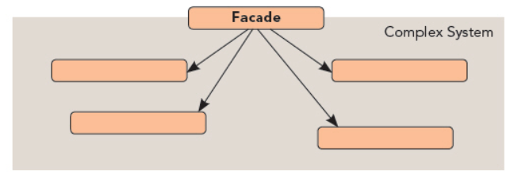

## 外观模式

UML图：

外观模式用来隐藏一个软件系统的所有内部实现，只提供给用户一个外观类。（JDBC就是一个典型的外观类）

三个组成部分：
1. 外观角色Facade：外观模式的核心，熟悉子系统功能，被客户所调用
2. 子系统角色：实现功能，通过外观角色和外部对接
3. 客户角色：调用外观角色得到功能。

外观模式优点：

    提高子系统的独立性，降低客户程序与子系统的直接耦合度，可以使系统层次化
外观模式的缺点：

    客户是有经验的程序员，但通过外观类无法满足需求，则需直接访问子系统

外观模式和适配器模式共同点/区别：

共同点：都是为了设计新接口而存在

区别：
1. 适配器模式目的是讲一个不合适使用的接口转化为一个可用的接口
2. 外观模式简化接口是为了更好地使用库类，提供一个易用的接口作为外观。
    