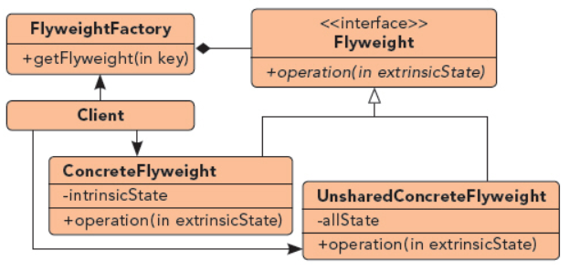

## 享元模式

UML图：

String使用享元模式

以共享的方式高效的支持大量细粒度对象，通过复用内存中存在的对象，降低性能消耗

**内蕴状态---intrinsicState**：

　　享元对象的内蕴状态是不会随环境的改变而改变的，是存储在享元对象内部的状态信息，因此内蕴状态是可以共享的，对于任何一个享元对象来讲，它的值是完全相同的。就想上边的“黑子”和“白子”，就像五子棋的颜色，代表的状态就是内蕴状态。

**外蕴状态---extrinsicState**：

　　享元对象的第二类状态就是外蕴状态，它会随着环境的改变而改变，因此是不可以共享的状态，对于不同的享元对象来说，它的值可能是不同的。享元对象的外蕴状态必须由客户端保存，在享元对象被创建之后，需要使用的时候再传入到享元对象内部，就像五子棋的位置信息，代表的就是享元对象的外蕴状态。

　　所以，享元对象的外蕴状态与内蕴状态是两类相互独立的状态，彼此没有关联。

组成部分
1. 享元抽象类/接口Flyweight：所有具体享元类的超类/接口，
2. 具体享元类ConcreteFlyweight：实现享元接口的具体类，若有内蕴状态，需为内蕴状态分配空间
3. 享元工厂类FlyweightFactory：负责拿出对应的享元，相当于工厂模式+单例模式

单例模式是一种特殊的享元模式，其内部只有一个对象被共享
