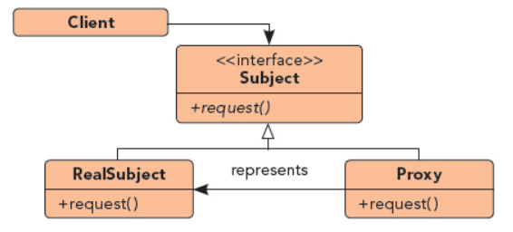

## 代理模式

UML图：

代理模式给某一对象提供一个代理对象，并由代理对象控制对原对象的引用，即中介

1. 静态代理

        优点：可以做到在符合开闭原则的情况下对目标对象进行功能扩展。 
        缺点：我们得为每一个服务都得创建代理类，工作量太大，不易管理。同时接口一旦发生改变，代理类也得相应修改。
2. 动态代理---jdk代理（reflect包中）

        Proxy.newProxyInstance()方法三个参数：
        ClassLoader loader: 用于定义代理类的类加载器---the class loader to define the proxy class
        Class<?>[] interfaces: 代理类实现的接口列表---the list of interfaces for the proxy class to implement
        InvocationHandler: 用于发放方法调用的方法处理器---the invocation handler to dispatch method invocations to
        
        优点：减少开发任务、减少对业务接口的依赖、降低耦合度
        缺点：动态代理类无法实现对class的动态代理